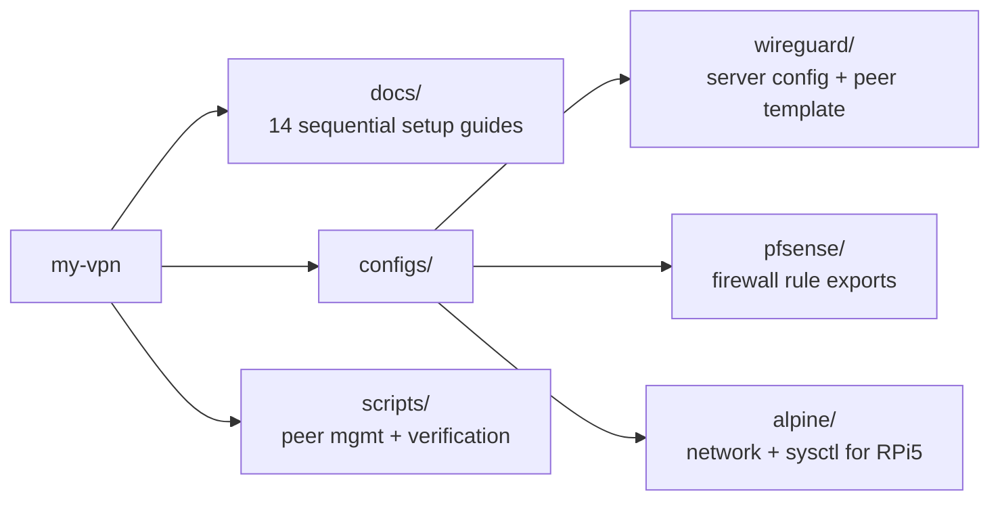

# my-vpn

Self-hosted WireGuard VPN — RPi5 in a DMZ behind pfSense.

```mermaid
graph LR
    root[my-vpn]
    root --> docs[docs/\n14 sequential setup guides]
    root --> configs[configs/]
    root --> scripts[scripts/\npeer mgmt + verification]
    configs --> wg[wireguard/\nserver config + peer template]
    configs --> pf[pfsense/\nfirewall rule exports]
    configs --> al[alpine/\nnetwork + sysctl for RPi5]
```